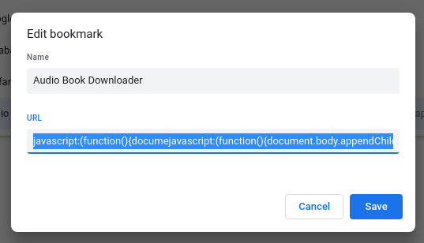
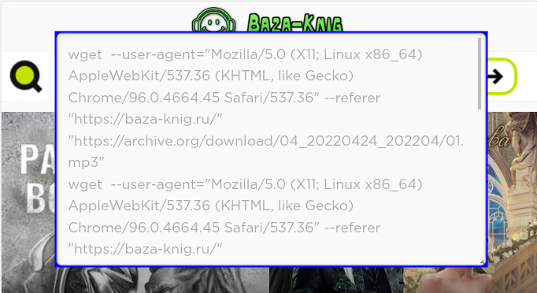
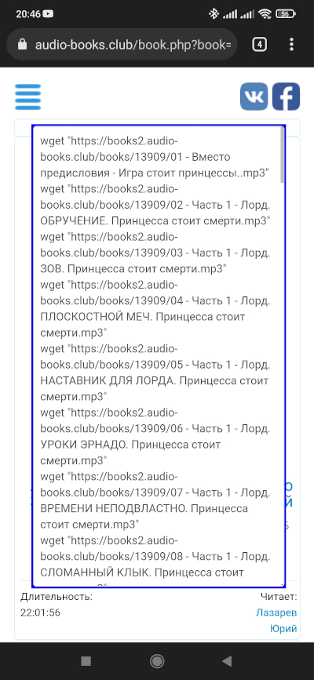

# Audio Book Links Extractor

В сети можно найти много сайтов с аудиокнижками. При этом книжки проигрываются встроенным плеером, который работает только при наличии интрернета.
Было бы удобно скачать mp3 файлы чтобы проигрывать их на телефоне offline.

Конечно, можно найти ссылки на mp3 файлы в коде страницы, но делать это каждый раз довольно кропотливо.

Представляю вашему вниманию "извлекатель ссылок на mp3 файлы". 

Данный скрипт работает как букмакрлет. Букмарклет это фрагмент javascript кода исполняемый на страничке браузера при помощи меню закладок.

В настоящее время поддерживаются следующие сайты:

- baza-knig.ru
- vse-audioknigi.com
- knigorai.com
- audio-books.club

## Использование букмарлета

Добавьте в закладки браузера букмарклет со следующим содержимым:
```
javascript:(function(){documejavascript:(function(){document.body.appendChild(document.createElement('script')).src='https://maxistar.ru/kitchen/bookmarklet/abdownload.js';})();})();
```


Запуская скриплет на странице с аудиокнижкой вы получаете список ссылок для скачивания через wget:



Полученные команды скопируйте в shell.

## Мобильный chrome

Скриплет работает в мобильном chrome, для этого начните набирать в строке поиска название скриплета:


Результат появится на странице:




**Дисклаймер**. Использование данного скрипта целиком на вашей совести. Нарушать авторские права нехорошо. 
Если книжка вам понравилась - найдите способ отблагодарить автора! 